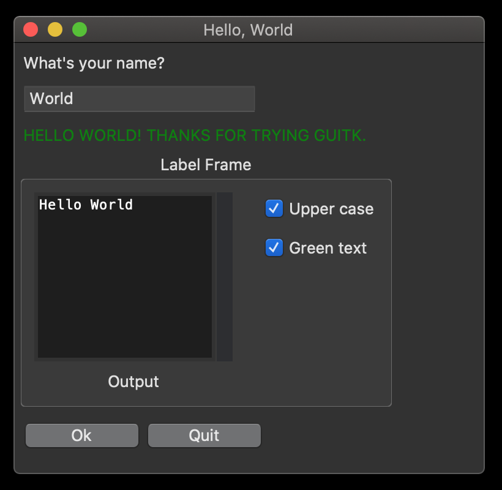

<!-- DO NOT EDIT README.md, instead edit README.mdpp and process with MarkdownPP using build_readme.sh -->

# Python GUI Toolkit for TK (guitk)

## Synopsis

guitk is an experiment to design a lightweight framework that simplifies creating simple GUIs with [tkinter](https://docs.python.org/3/library/tkinter.html).  This is very much early alpha stage but in constant development so check back frequently if this interests you or open an issue to start a conversation about what pain points this project could help you solve!

## Code Example

```python
"""Simple Hello World example using guitk """

import guitk


# subclass guitk.Window as the starting point for your app's main window
class HelloWindow(guitk.Window):

    def config(self):
        # define a layout for the window
        # you must have a class variable named `layout` or you'll get an empty window
        self.layout = [
            [guitk.Label("What's your name?")],
            [guitk.Entry(key="name")],
            [guitk.Button("Ok")],
        ]
        self.title = "Hello, World"

    # define your event loop
    # every guitk.Window will call self.handle_event to handle GUI events
    # event is a guitk.Event object
    def handle_event(self, event):
        print(f"Hello {self['name'].value}")


# run your event loop
if __name__ == "__main__":
    HelloWindow().run()
```


## Motivation

I did not set out to create yet another python GUI framework -- there are already many of these, some of them quite good.  I wanted to create a simple GUI for [another python project](https://github.com/RhetTbull/osxphotos) and started down the path using [PySimpleGUI](https://github.com/PySimpleGUI/PySimpleGUI).  PySimpleGUI has an amazingly simple interface that allows creation of nice looking GUIs with just a few lines of code.  Unfortunately, after spending some time prototyping with PySimpleGUI, I discovered a few issues with PySimpleGUI (see below).  I evaluated several other GUI frameworks including [Toga](https://github.com/beeware/toga), [wxPython](https://www.wxpython.org/), [pyglet](https://github.com/pyglet/pyglet), [remi](https://github.com/dddomodossola/remi), and [tkinter](https://docs.python.org/3/library/tkinter.html).  None of these was as simple as PySimpleGUI and several had other issues, e.g. errors running under MacOS, steep learning curve, etc. 

I settled on using tkinter because it's included with python, well-supported on multiple platforms, and relatively light-weight.  However, I found tkinter took a bit too much boiler plate compared to PySimpleGUI and the callback style of programming GUI actions didn't fit my brain as well as the single event-loop used in PySimpleGUI.  

guitk is my attempt to provide an event-loop interface to tkinter.  It is not intended to abstract away the tkinter interface and you'll need some knowledge of tkinter to use guitk.  I highly recommend Mark Roseman's excellent [Modern Tkinter for Busy Python Developers](https://tkdocs.com/book.html) book as a starting point.

### Why not just use PySimpleGUI?

[PySimpleGUI](https://github.com/PySimpleGUI/PySimpleGUI) has a really well designed interface that is [incredibly well documented](https://pysimplegui.readthedocs.io/en/latest/), it supports at least 4 different GUI frameworks, is cross-platform, and is actively maintained.  You really should take a look at PySimpleGUI if you need to create a GUI in python.  Unfortunately, it currently has several issues that led me to look for an alternative. 

* I develop on a Mac and PySimple GUI has a number of [issues](https://github.com/PySimpleGUI/PySimpleGUI/issues?q=is%3Aopen+is%3Aissue+label%3A%22Mac+Specific+Issue%22) running under MacOS and is not as well supported on the Mac.
* PySimpleGUI is licensed under a modified LGPL3 license with several added stipulations such as prohibitions on re-posting the code and removal of any comments from the code that don't meet my personal definition of Free Software. 
* PySimpleGUI source code is a bit of a mess.  I considered attempting to tackle some of the existing MacOS issues but the license stipulations and state of the source code dissuaded me.

Again, if you can live with these concerns, I highly recommend you consider PySimpleGUI.

## Installation

* `git clone git@github.com:RhetTbull/guitk.git`
* `cd guitk`
* `python3 setup.py install`

## Anatomy of a guitk program 

```python
"""Hello World example using guitk """

import guitk


# subclass guitk.Window as the starting point for your app's main window
class HelloWorld(guitk.Window):

    # every Window class needs a config() method that
    # defines the title and the layout (and optionally menu and other other settings)
    def config(self):
        # Title for the window
        self.title = "Hello, World"

        # Define the window's contents
        # guitk.Label corresponds to a tkinter.ttk.Label, etc.
        # optionally provide a unique key to each element to easily reference the element later
        # layouts are lists of lists where each list corresponds to a row in the GUI
        self.layout = [
            [guitk.Label("What's your name?")],
            [guitk.Entry(key="ENTRY_NAME", events=True)],
            [guitk.Label("", width=40, key="OUTPUT", columnspan=2)],
            [guitk.Button("Ok"), guitk.Button("Quit")],
        ]

    # Interact with the Window using an event Loop
    # every guitk.Window will call self.handle_event to handle GUI events
    # event is a guitk.Event object
    def handle_event(self, event):
        # the value of each widget can be read using event.values["KEYNAME"]
        name = self["ENTRY_NAME"].value

        if event.key == "Quit":
            # a key wasn't supplied in `guitk.Button("Quit")` so guitk uses the name of the button
            # value passed to quit will be returned by HelloWorld.run()
            self.quit(name)

        if event.key == "Ok":
            # set the output Label to the value of the Entry box
            # individual widgets can be accessed by their key; the window object acts as a dictionary of widgets
            self["OUTPUT"].value = f"Hello {name}! Thanks for trying guitk."

        if event.event_type == guitk.EventType.KeyRelease:
            # events can be handled by event type as well as even key
            print(event)


if __name__ == "__main__":
    # instantiate your Window class and run it
    name = HelloWorld().run()
    print(f"HelloWorld: {name}")
```


guitk GUIs are created using a lists of lists where each element in the lists corresponds to a ttk or tk element.  This design pattern is borrowed from PySimpleGUI.

```python
""" Example for guitk showing how to use lists of lists for creating GUI layout """

import guitk


class LayoutDemo(guitk.Window):
    def config(self):
        self.title = "Layouts are Lists of Lists"
        self.layout = [
            [guitk.Label("Row 1"), guitk.Label("What's your name?")],
            [guitk.Label("Row 2"), guitk.Entry()],
            [guitk.Label("Row 3"), guitk.Button("Ok")],
        ]

    def handle_event(self, event):
        if event.key == "Ok":
            print("Ok!")


if __name__ == "__main__":
    LayoutDemo().run()
```


Because layouts are simply lists of lists, you can use python to create layouts programmatically, for example using list comprehensions.

```python
""" Example for guitk showing how to use list comprehensions to create a GUI """

import guitk


class LayoutDemo(guitk.Window):
    def config(self):
        self.title = "List Comprehension"
        # use list comprehension to generate 4x4 grid of buttons with tooltips
        # use the tooltip named argument to add tooltip text to any element
        self.layout = [
            [
                guitk.Button(
                    f"{row}, {col}", padx=0, pady=0, tooltip=f"Tooltip: {row},{col}"
                )
                for col in range(4)
            ]
            for row in range(4)
        ]

    # Interact with the Window using an event Loop
    def handle_event(self, event):
        if event.event_type == guitk.EventType.ButtonPress:
            # print the key for the button that was pressed
            print(self[event.key].value)


if __name__ == "__main__":
    LayoutDemo().run()
```


A more complex example showing how to use the event handler to react to events and change the value of other GUI elements.

```python
""" Another Hello World example for guitk showing how to use the event handler """

import guitk
import tkinter as tk


class HelloWorld(guitk.Window):

    def config(self):
        self.title = "Hello, World"

        # Define the window's contents
        # use variables to define rows to make your layout more readable
        # use guitk.Frame to group sub-layouts into columns
        label_frame = guitk.LabelFrame(
            "Label Frame",
            labelanchor=tk.N,
            layout=[
                [
                    guitk.Frame(
                        layout=[
                            [guitk.Output(width=20, height=10)],
                            [guitk.Label("Output", key="LABEL_OUTPUT", sticky=tk.S)],
                        ]
                    ),
                    guitk.Frame(
                        layout=[
                            [None, guitk.Checkbutton("Upper case", key="CHECK_UPPER")],
                            [None, guitk.Checkbutton("Green text", key="CHECK_GREEN")],
                        ],
                        sticky="n",
                    ),
                ]
            ],
        )

        self.layout = [
            [guitk.Label("What's your name?")],
            [guitk.Entry(key="ENTRY_NAME")],
            [guitk.Label("", width=40, key="OUTPUT")],
            [label_frame],
            [guitk.Button("Ok"), guitk.Button("Quit")],
        ]

        # you can define custom padding around widgets with padx, pady
        # see https://tkdocs.com/tutorial/grid.html#padding
        self.padx = 3
        self.pady = 3

    # Interact with the Window using an event Loop
    def handle_event(self, event):
        if event.key == "Quit":
            self.quit()

        if event.key == "Ok":
            # set the output Label to the value of the Entry box
            # the Window class acts like a dictionary for looking up guitk element objects by key
            name = self["ENTRY_NAME"].value
            print(f"Hello {name}")
            self["OUTPUT"].value = f"Hello {name}! Thanks for trying guitk."

        if event.key == "CHECK_UPPER" and self["CHECK_UPPER"].value:
            # True if checked
            # "Upper case" check button is checked, so make text upper case
            self["OUTPUT"].value = self["OUTPUT"].value.upper()

        if event.key == "CHECK_GREEN":
            # change label text color to green if needed
            # use .widget to access the underlying ttk element for each object
            # tkinter is not abstracted -- you can easily use tkinter methods and properties if needed
            if self["CHECK_GREEN"].value:
                # checked
                self["OUTPUT"].widget["foreground"] = "green"
            else:
                # not checked
                self["OUTPUT"].widget["foreground"] = ""


if __name__ == "__main__":
    # add some padding around GUI elements to make it prettier
    HelloWorld().run()
```



You can create virtual events that fire after a time delay and these can be repeating.

```python
""" Example showing how to use bind_timer_event """

import time
import tkinter as tk

import guitk


class TimerWindow(guitk.Window):
    def config(self):
        self.title = "Timer Window"

        self.layout = [
            [guitk.Label("Press Start Timer to fire event after 2000 ms")],
            [guitk.Label("", width=60, key="OUTPUT")],
            [
                guitk.Button("Start Timer"),
                guitk.Button("Cancel Timer"),
                guitk.Checkbutton("Repeat", key="REPEAT"),
            ],
        ]

    def setup(self):
        # store the id of the running timer so it can be cancelled
        self.data = {"timer_id": None}

    # Interact with the Window using an event Loop
    def handle_event(self, event):
        if event.key == "Quit":
            self.quit()

        if event.key == "Start Timer":
            # this simple demo assumes only one timer running at a time
            repeat = self["REPEAT"].value  # value of Repeat Checkbutton
            self.data["timer_id"] = self.bind_timer_event(
                2000, "<<MyTimer>>", repeat=repeat
            )
            self[
                "OUTPUT"
            ].value = f"Timer {self.data['timer_id']} started at {time.time():.2f}"

        if event.key == "<<MyTimer>>":
            self["OUTPUT"].value = f"Timer went off at {time.time():.2f}!"

        if event.key == "Cancel Timer":
            self.cancel_timer_event(self.data["timer_id"])
            self[
                "OUTPUT"
            ].value = f"Timer {self.data['timer_id']} canceled at {time.time():.2f}"


if __name__ == "__main__":
    # add some padding around GUI elements to make it prettier
    TimerWindow().run()
```


You can access the underlying ttk widget, for example, to change style.  guitk also implements some additional widgets link `LinkLabel` which is a `ttk.Label()` that generates an event when clicked and changes mouse cursor to pointing hand (like a URL does).

```python
""" Demonstrates use of LinkLabel widget """

import guitk
from tkinter import ttk


class ClickMe(guitk.Window):
    def config(self):
        self.title = "Click me!"

        # you can pass tkinter.ttk options to the widgets
        # e.g. width and anchor
        self.layout = [
            [
                guitk.LinkLabel(
                    "Click me!",
                    width=20,
                    anchor="center",
                    key="CLICK_ME",
                    underline_font=True,
                )
            ]
        ]
        self.padx = 20
        self.pady = 20

    def setup(self):
        # setup gets called immediately before the window is shown

        # configure the Click Me label to be blue
        style = ttk.Style()
        style.configure("Blue.TLabel", foreground="blue")

        # use .widget to access the underlying tkinter ttk object, 
        # in this case, a tkinter.ttk.Label
        self["CLICK_ME"].widget.configure(style="Blue.TLabel")

    def handle_event(self, event):
        print(event)


if __name__ == "__main__":
    ClickMe().run()
```


## Contributors

Contributions welcome! If this project interests you, open an Issue or send a PR!

## TODO

- [x] Basic prototype
- [x] Frame
- [x] Label
- [x] Entry
- [x] Button
- [x] Checkbutton
- [x] Text
- [x] ScrolledText
- [ ] Other widgets
- [x] Tooltips
- [ ] Documentation
- [ ] Add docstrings
- [ ] Add typehints to public API
- [ ] Add properties for public class attributes
- [ ] Tests

## License

MIT License with exception of `tooltips.py` which is licensed under the Python Software Foundation License Version 2.  Both are very permissive licenses.
