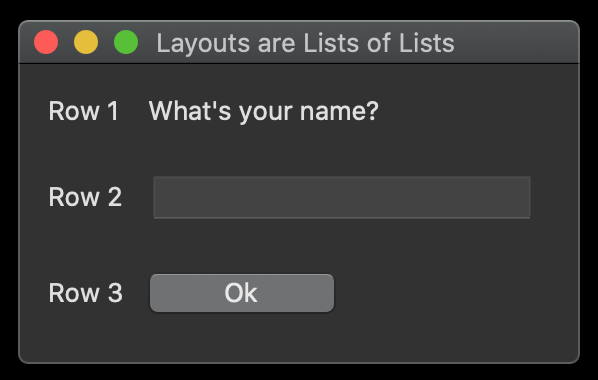
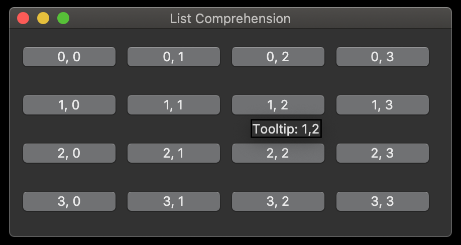

# Python GUI Toolkit for TK (guitk)

## Synopsis

Yes, this is yet another python GUI framework/wrapper.  guitk is an experiment to design a toolkit that simplifies creating simple GUIs with [tkinter](https://docs.python.org/3/library/tkinter.html).

## Code Example

```python
"""Simple Hello World example using guitk """

import guitk

class HelloWindow(guitk.Window):
    layout = [
        [guitk.Label("What's your name?")],
        [guitk.Entry(key="name")],
        [guitk.Button("Ok")],
    ]

    def handle_event(self, event):
        print(f"Hello {event.values['name']}")


if __name__ == "__main__":
    HelloWindow("Window Title").run()
```


## Motivation

I did not set out to create yet another python GUI framework -- there are already many of these, some of them quite good.  I wanted to create a simple GUI for [another python project](https://github.com/RhetTbull/osxphotos) and started down the path using [PySimpleGUI](https://github.com/PySimpleGUI/PySimpleGUI).  PySimpleGUI has an amazingly simple interface that allows creation of nice looking GUIs with just a few lines of code.  Unfortunately, after spending some time prototyping with PySimpleGUI, I discovered a few issues with PySimpleGUI (see below).  I evaluated several other GUI frameworks including [Toga](https://github.com/beeware/toga), [wxPython](https://www.wxpython.org/), [pyglet](https://github.com/pyglet/pyglet), [remi](https://github.com/dddomodossola/remi), and [tkinter](https://docs.python.org/3/library/tkinter.html).  None of these was as simple as PySimpleGUI and several had other issues, e.g. errors running under MacOS, steep learning curve, etc. 

I settled on using tkinter because it's included with python, well-supported on multiple platforms, and relatively light-weight.  However, I found tkinter took a bit too much boiler plate compared to PySimpleGUI and the callback style of programming GUI actions didn't fit my brain as well as the single event-loop used in PySimpleGUI.  

guitk is my attempt to provide an event-loop interface to tkinter.  It is not intended to abstract away the tkinter interface and you'll need some knowledge of tkinter to use guitk.  I highly recommend Mark Roseman's excellent [Modern Tkinter for Busy Python Developers](https://tkdocs.com/book.html) book as a starting point.

### Why not just use PySimpleGUI?

[PySimpleGUI](https://github.com/PySimpleGUI/PySimpleGUI) has a really well designed interface that is [incredibly well documented](https://pysimplegui.readthedocs.io/en/latest/), it supports at least 4 different GUI frameworks, is cross-platform, and is actively maintained.  You really should take a look at PySimpleGUI if you need to create a GUI in python.  Unfortunately, it currently has several issues that led me to look for an alternative. 

* I develop on a Mac and PySimple GUI has a number of [issues](https://github.com/PySimpleGUI/PySimpleGUI/issues?q=is%3Aopen+is%3Aissue+label%3A%22Mac+Specific+Issue%22) running under MacOS and is not as well supported on the Mac.
* PySimpleGUI is licensed under a modified LGPL3 license with several added stipulations such as prohibitions on re-posting the code and removal of any comments from the code that don't meet my personal definition of Free Software. 
* PySimpleGUI source code is a bit of a mess.  I considered attempting to tackle some of the existing MacOS issues but the license stipulations and state of the source code dissuaded me.

Again, if you can live with these concerns, I highly recommend you consider PySimpleGUI.

### Should I use guitk in my own project?

No. You definitely should not. At best, this is currently a pre-alpha experiment.  I am attempting though, to get this to an MVP state that's usable in one of my other projects.

## Installation

* `git clone git@github.com:RhetTbull/guitk.git`
* `cd guitk`
* `python3 setup.py install`

## A Few More Examples

```python
"""Hello World example using guitk """

import guitk


# subclass guitk.Window as the starting point for your app's main window
class HelloWorld(guitk.Window):
    # Define the window's contents
    # you must have a class variable named `layout` or you'll get an empty window
    # guitk.Label corresponds to a tkinter.ttk.Label, etc.
    # optionally provide a unique key to each element to easily reference the element later
    # layouts are lists of lists where each list corresponds to a row in the GUI
    layout = [
        [guitk.Label("What's your name?")],
        [guitk.Entry(key="ENTRY_NAME")],
        [guitk.Label("", width=40, key="OUTPUT", columnspan=2)],
        [guitk.Button("Ok"), guitk.Button("Quit")],
    ]

    # Interact with the Window using an event Loop
    # every guitk.Window will call self.handle_event to handle GUI events
    # event is a guitk.Event object
    def handle_event(self, event):
        name = event.values["ENTRY_NAME"]

        if event.key == "Quit":
            # value passed to quit will be returned by HelloWorld.run()
            self.quit(name)

        if event.key == "Ok":
            # set the output Label to the value of the Entry box
            self["OUTPUT"].value = f"Hello {name}! Thanks for trying guitk."


if __name__ == "__main__":
    # instantiate your Window class with a title and run it
    name = HelloWorld("Hello, World").run()
    print(f"HelloWorld: {name}")
```


guitk GUIs are created using a lists of lists where each element in the lists corresponds to a ttk or tk element.  This design pattern is borrowed from PySimpleGUI.

```python
""" Example for guitk showing how to use lists of lists for creating GUI layout """

import guitk


class LayoutDemo(guitk.Window):

    layout = [
        [guitk.Label("Row 1"), guitk.Label("What's your name?")],
        [guitk.Label("Row 2"), guitk.Entry()],
        [guitk.Label("Row 3"), guitk.Button("Ok")],
    ]

    def handle_event(self, event):
        if event.key == "Ok":
            print("Ok!")


if __name__ == "__main__":
    LayoutDemo("Layouts are Lists of Lists", padx=5, pady=5).run()
```



Because layouts are simply lists of lists, you can use python to create layouts programmatically, for example using list comprehensions.

```python
""" Example for guitk showing how to use list comprehensions to create a GUI """

import guitk


class LayoutDemo(guitk.Window):

    # use list comprehension to generate 4x4 grid of buttons with tooltips
    # use the tooltip named argument to add tooltip text to any element
    layout = [
        [
            guitk.Button(f"{row}, {col}", padx=0, pady=0, tooltip=f"Tooltip: {row},{col}")
            for col in range(4)
        ]
        for row in range(4)
    ]

    # Interact with the Window using an event Loop
    def handle_event(self, event):
        if event.event == guitk.EventType.BUTTON_PRESS:
            # print the key for the button that was pressed
            print(event.values[event.key])


if __name__ == "__main__":
    LayoutDemo("List Comprehension", padx=5, pady=5).run()
```



A more complex example showing how to use the event handler to react to events and change the value of other GUI elements.

```python
""" Another Hello World example for guitk showing how to use the event handler """

import guitk
import tkinter as tk


class HelloWorld(guitk.Window):
    # Define the window's contents
    # use variables to define rows to make your layout more readable
    label_frame = guitk.LabelFrame(
        "Label Frame",
        labelanchor=tk.N,
        layout=[
            [
                guitk.Frame(
                    layout=[
                        [guitk.Output(width=20, height=10)],
                        [guitk.Label("Output", key="LABEL_OUTPUT", sticky=tk.S)],
                    ],
                    padx=0,
                ),
                guitk.Frame(
                    layout=[
                        [None, guitk.CheckButton("Upper case", key="CHECK_UPPER")],
                        [None, guitk.CheckButton("Green text", key="CHECK_GREEN")],
                    ],
                    padx=0,
                    sticky="n",
                ),
            ]
        ],
    )

    layout = [
        [guitk.Label("What's your name?")],
        [guitk.Entry(key="ENTRY_NAME")],
        [guitk.Label("", width=40, key="OUTPUT")],
        [label_frame],
        [guitk.Frame(layout=[[guitk.Button("Ok"), guitk.Button("Quit")]])],
    ]
    # Interact with the Window using an event Loop
    def handle_event(self, event):
        if event.key == "Quit":
            self.quit()

        if event.key == "Ok":
            # set the output Label to the value of the Entry box
            # the Window class acts like a dictionary for looking up guitk element objects by key
            name = event.values["ENTRY_NAME"]
            self["OUTPUT"].value = f"Hello {name}! Thanks for trying guitk."

        if event.key == "CHECK_UPPER" and event.values["CHECK_UPPER"]:
            # True if checked
            # "Upper case" check button is checked, so make text upper case
            self["OUTPUT"].value = self["OUTPUT"].value.upper()

        if event.key == "CHECK_GREEN":
            # change label text color to green if needed
            # use .element to access the underlying ttk element for each object
            # tkinter is not abstracted -- you can easily use tkinter methods and properties if needed
            if event.values["CHECK_GREEN"]:
                # checked
                self["OUTPUT"].element["foreground"] = "green"
            else:
                # not checked
                self["OUTPUT"].element["foreground"] = ""


if __name__ == "__main__":
    # add some padding around GUI elements to make it prettier
    HelloWorld("Hello, World", padx=5, pady=5).run()
```


## Contributors

Contributions welcome! If this project interests you, open an Issue or send a PR!

## TODO

- [x] Basic prototype
- [x] Frame
- [x] Label
- [x] Entry
- [x] Button
- [x] Checkbutton
- [x] Text
- [x] ScrolledText
- [ ] Other widgets
- [x] Tooltips
- [ ] Documentation
- [ ] Tests

## License

MIT License with exception of `tooltips.py` which is licensed under the Python Software Foundation License Version 2.  Both are very permissive licenses.
