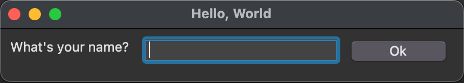

<!--* DO NOT EDIT tutorial.md, instead edit tutorial.mdpp and process with MarkdownPP using doit (see dodo.py) -->

# GUITk Tutorial

## Overview of the GUITk Library

GUITk is a declarative framework, built on [tkinter](https://docs.python.org/3/library/tkinter.html),
for building nice-looking, cross-platform GUIs in Python. The goal of GUITk is to make it easy to build
GUIs without knowing a lot about tkinter.
The GUITk object model is partially inspired by [SwiftUI](https://developer.apple.com/documentation/swiftui).

GUITk wraps tkinter widgets in GUITk objects. Instead of the standard tkinter geometry managers
([pack](https://docs.python.org/3/library/tkinter.html?highlight=tkinter#the-packer), 
[grid](https://tkdocs.com/tutorial/grid.html), [place](https://www.pythonguis.com/faq/pack-place-and-grid-in-tkinter/)),
GUITk uses declarative layout objects to place widgets in a window. GUITk also provides a declarative

### Why tkinter?

GUITk builds on tkinter because tkinter is a mature, stable, cross-platform GUI framework that is included
in the Python standard library. tkinter was first added to Python 1.4 in 1996 and runs on most platforms.
It is not, however, the easiest to use nor the most pythonic GUI framework. GUITk aims to make it easier
to build GUIs with tkinter. Standard tkinter widgets look somewhat dated but tkinter includes themed widgets
([ttk](https://docs.python.org/3/library/tkinter.ttk.html)) that look much better. GUITk uses ttk widgets
whenever possible.

## Basic Concepts

Let's start with an example. The following "hello world" example creates a window with a label, a text entry box, and a button.
When the user presses Return or clicks the button, a greeting is printed to the console.

<!--* This image updated with doit for README.md -->


<!--* The code is updated with mdpp which is run from project root so include paths are relative to project root -->
```python
"""Simple Hello World example using guitk """

import guitk as ui


# subclass guitk.Window as the starting point for your app's main window
class HelloWindow(ui.Window):
    def config(self):
        """Configure the window"""

        # set the window title
        self.title = "Hello, World"

        # define a layout for the window
        # the layout manager will automatically add widgets to the window
        with ui.HLayout():
            ui.Label("What's your name?")
            ui.Entry(key="name", focus=True)
            ui.Button("Ok", key="ok")

    @ui.on(key="ok")
    def on_ok(self, event: ui.Event):
        """Handle the Ok button click"""
        print("Hello, ", self.get("name").value)


# run your event loop
if __name__ == "__main__":
    HelloWindow().run()
```

A few things to note about this example:

- The `HelloWindow` class subclasses `guitk.Window`. This is the starting point for your app's main window.
- The `HelloWindow` class defines a `config` method that configures the window. `config()` is a special method
   that is called by GUITk before the window is created. It is used to configure the window's title, size, and
   widgets. Your window class must define a `config()` method.
- Widgets are added to your window using a layout manager. Creating an instance of a layout manager within your
   `config()` method adds it to the window. The `HelloWindow` class uses an `HLayout()` layout manager which
    arranges widgets horizontally.
- Widgets, such as `Label` (static text), `Entry` (text entry box), and `Button`, are added to the window by
   creating instances of them within the context of the layout manager.
- Every widget has an optional key, which is a unique identifier for the widget. In this example, the "Ok" button
   has a key of "ok".
- Events (such as a button press) are handled using the `@on()` decorator. The `@on()` decorator is used to
   register a callback function that is called when the event occurs. In this example, the `on_ok()` function
    is called when the user presses Return or clicks the "Ok" button (because the button has a key of "ok" which
    the `on_ok()` function is registered to handle).

## Creating a Window

Every GUITk app must have at least one class that subclasses `guitk.Window`. This class is the starting point
for your app's main window. An app may have multiple windows but one of them must be the main window. The main
window is created by calling the `run()` method on the window class. The `run()` method starts the main event
loop and displays the window.

The `Window` class has a `config()` method that is called by GUITk before the window is created. You must define
a `config()` method in your window class in order to display any widgets in the window (and without widgets, your
window would be a pretty boring GUI). The config method will be automatically called by GUITk before the window
is displayed. You should not need to create an `__init__()` method in your window class as all configuration
is done in the `config()` method.

Here is a minimal window class:

<!--[[[cog
import os
os.system("python3 utils/screenshot.py docs/examples/minimal_window.py MinimalWindow docs/images/minimal_window.py.png --overwrite")
]]]-->
<!--[[[end]]]-->


<!--* The code is updated with mdpp which is run from project root so include paths are relative to project root -->
```python
"""Minimal example of a GUITk Window"""

import guitk as ui


class MinimalWindow(ui.Window):
    def config(self):
        with ui.VLayout():
            ui.Label("Hello World!")


if __name__ == "__main__":
    MinimalWindow().run()
```

### Window Configuration

The `config()` method is used to configure the window. When subclassing `guitk.Window`, you must define a `config()` method.
You do not need to call the `config()` method yourself nor should you call the superclass `config()` method. GUITk will call
`config()` for you before the window is created.

In `config()`, you can set the title and size of the window and create your layout by creating an instance of GUITk Layout Manager.

For example, here is a window with a title and size:

```python
class MyWindow(guitk.Window):
    def config(self):
        self.title = "My Window"
        self.size = (400, 300)
```

Window size (in pixels) can be set as a tuple of (width, height) or as a string in the form "widthxheight" (e.g. "400x300").
Consistent with tkinter, the window size can also be set by setting `self.geometry`:

```python
class MyWindow(guitk.Window):
    def config(self):
        self.title = "My Window"
        self.geometry = "400x300"
```

Layouts are covered in more detail in the next section.

### Window Methods

In addition to the `config()` method, you can define the following methods in your window class and if defined, they will be called by GUITk:

`setup(self) -> None` - called after the window is created (after `config()`) but before it is displayed. This is a good place to initialize your app's state.
If you need to access any of the underlying tkinter widgets, you can do so in `setup()` as the widgets will have been created by this point.

`teardown(self) -> None` - called when the window is closed. This is a good place to clean up any resources used by your app.

`handle_event(self, event: guitk.Event) -> None` - called when an event occurs. This is a good place to handle events that are not handled by widgets or by the `@on()` decorator.
The GUITk event system is covered in more detail in a later section.

Here's an example of a window with a title and size and the `setup()`, `teardown()`, and `handle_event()` methods defined:

<!--* The code is updated with mdpp which is run from project root so include paths are relative to project root -->
```python
"""Hello World example using guitk """

import guitk as ui


class HelloWorld(ui.Window):
    # subclass guitk.Window as the starting point for your app's main window
    def config(self):
        # Your Window class needs to define a config() method that describes the layout, title, etc for your app
        # config() is called by the Window class when the Window is being created

        # Title for the window
        self.title = "Hello, World"

        # optionally set size as a tuple of (width, height)
        self.size = (320, 240)

        # you can also use self.geometry for consistency with tkinter
        # self.geometry = "320x240"

        # Define the window's contents
        # guitk.Label corresponds to a tkinter.ttk.Label, etc.
        # optionally provide a unique key to each element to easily reference the element later
        # use a HLayout or VLayout class to define the layout of the window
        # HLayout arranges widgets horizontally, VLayout arranges widgets vertically
        with ui.VLayout():
            # use a VLayout to stack the widgets vertically
            # standard tkinter layout options such as sticky and weight are supported
            ui.Label("What's your name?", sticky="ew", anchor="center", weightx=1)
            # each widget can be assigned a key, which should be unique, to easily reference the widget later
            # set focus=True so the Entry box has focus when the window is displayed
            ui.Entry(key="entry_name", focus=True, weightx=1, sticky="ew")
            ui.Label("", width=40, key="output")
            with ui.HStack():
                # align these two buttons in a horizontal row using HStack
                ui.Button("Ok")
                ui.Button("Quit")

    # Every Window class has 3 special methods that can be overridden to provide custom behavior
    # you do not need to provide any of these methods if you do not need to customize the default behavior
    # (the default behavior is to do nothing)
    # These special methods are: setup(), teardown(), and handle_event()

    def setup(self):
        """Perform any initialization needed before the Window is displayed"""
        # your setup() method is called by the Window class after config() just before the Window is displayed
        # use this to initialize any internal state you need
        # you do not need to provide a setup() method if no initialization is needed
        print("setup")

    def teardown(self):
        """Perform any cleanup needed before destroying the window"""
        # your teardown() method is called by the Window class after the Window is closed
        # use this to clean up before the Window is destroyed
        # you do not need to provide a teardown() method if no cleanup is needed
        print("teardown")

    def handle_event(self, event: ui.Event):
        """handle_event() is called by the Window class when an event occurs"""
        # you do not need to provide a handle_event() method if you prefer to use
        # the @on decorator to bind functions to events (see below)
        # handle_event() is a useful place to put code that needs to run for every event
        # or for use during debugging
        print(f"handle_event: {event}")

    @ui.on(key="Quit")
    def on_quit(self):
        # return the value of the Entry box
        self.quit(self["entry_name"].value)

    @ui.on(key="Ok")
    @ui.on(event_type=ui.EventType.EntryReturn)
    def on_ok(self):
        # User pressed the OK button or the Return key inside the Entry box
        # the @on decorator can be used to bind a function to an event
        # @on can be repeated to bind the function to multiple events
        # set the output Label to the value of the Entry box
        # individual widgets can be accessed by their key; the window object acts as a dictionary of widgets
        greeting = f"Hello {self['entry_name'].value}! Thanks for trying guitk."

        # if you prefer, you can use get() instead of the dictionary syntax
        self.get("output").value = greeting


if __name__ == "__main__":
    # instantiate your Window class and run it
    name = HelloWorld().run()
    print(f"Hello {name}")
```

### Starting the App

Once you have defined your window class, you can start the app by calling the `run()` method on the window class:

```python
MyWindow.run()
```

This creates the window and starts the tkinter event loop. The `run()` method does not return until the window is closed.
Child windows may be created in your class by creating an instance of a window class, for example, `child = MyChildWindow()`, but you
should call `run()` only on the main window.

## Layouts

## Events

## TODO: finish tutorial

This tutorial is a work in progress. More to come soon...
